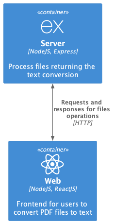

# Latii tech test
Latii code challenge. The current monorepo contains a server and web projects to convert PDF files to text.

<p align="center">
  
</p>

<sub>You can find the model C4 script of the image above [here](docs/project.infrastrure.puml).</sub>

## Overview:

This monorepository contains two projects: `/server` and `/web`. In this document you can find a detailed explanation of the project setup, technologies and available features.

## Index

1. [ Project sample ](#sample)
2. [ Using the app in the cloud ](#using-the-app-in-the-cloud)
3. [ Available endpoints ](#available-endpoints)
4. [ The `/server` ](#server)
5. [ The `/web` ](#web)
6. [ Authentication ](#authentication)
7. [ Security and monitoring ](#security-and-monitoring)
8. [ Data persistence ](#data-persistence)
9. [ Improvements ](#improvements)
10. [ Running the app in local ](#running-the-app)
11. [ Testing ](#testing)

### Sample
The project looks and uses like shown in the video:

https://user-images.githubusercontent.com/45525889/218515876-5f0405d9-219b-4d53-bb3a-80eba5f6fc99.mov

1. To use the service, you must set a username and password of an authenticated user. You can check the available credentials [here](/docs/credentials.md)
2. Once both values are written, click the "Set" button
3. Select the "Choose File" button and select the PDF file you want to convert to text
4. Click on the "Upload to convert" button to make the request and get the text in the file

## Using the app in the cloud

The server and web applications are deployed to [render](https://render.com/). You can check and follow the steps from above by entering in https://latii-web.onrender.com/. Is recommended the use of Chrome for correct styles loading. 

If you want to request the server directly, you can do it by pointing to https://latii-server.onrender.com.

## Available endpoints

You can find the list of endpoints available in this [section](/docs/api.md).

### `/server`

The server of the challenge is a NodeJS application built with TypeScript using Express as framework. The server handles files (PDF by the moment) and using a third party dependency (`pdf-to-text`), returns the text content of it.

Express was the chosen framework for the server due to the simplicity of the development using it (the project is not big enough to use some more structured frameworks) and the availability of third party libraries. Altough Fastify could have been chosen as well, my experience is way more related to Express.

The way the server was built enables an easy way to extend the convert-to-text funcionality to other kind of documents by using a common interface: `FileService`. This also allows to extend the set of methods over documents.

In adition, any kind of `FileService` or any other service can be easily injected to the routes using an `Injector` helper function. This `Injector` is a expression of the Dependecy Injection pattern due the lack of Inversion of Control tools enabled by Express (and not other frameworks like NestJS). This way to inject classes allows also a better way to test the code by decoupling a class with their dependencies.

Files are stored using `multer` in the local disk and deleted after the file is processed.

Testing was done using `jest` at unit and integration level. Besides, a line coverage threshold was set, so it forces developers to fully test the code (or at least, the 70% of the lines of code written in the project). This output can be passed down to a CI strategy to disable the merging and deployment if the requirements are not met.

Development experience was improved by exposing a `dev` script mode where live code reloading is enabled using `nodemon` and `ts-node`.


### `/web`

The front-end of the challenge is an NodeJS SPA built with TypeScript using ReactJS. The CSS was done using `bootstrap`. The front exposes a form that enables the uploading of a PDF file and sends it to the server (using `axios`) to the processing of it, showing the result in the same page.

ReactJS is well known for single page applications and it's where I'm more used to work in frontend as the way of development is related to POO and reactive programming, so that's why it was chosen. Altough a vanilla JS and HTML project could work, testing and a good development experience (using TypeScript) is way easier to achieve using React and the project setup is pretty straightforward using Create React App.

The frontend is based on components that encapsulates certain sections of the application. In the case of the challenge, was created a `FileUpload` component that draws a form and has the logic to: set a file to upload it, show a loading bar to see the progress of the processing and show the result of the conversion.

The HTTP client that enables the upload of the file is separated from the UI and reactive logic of the components in a `file.http.client` service. The concerns are split so changes in the way the request is done, shouldn't modify UI or its logic.

Testing was done using `jest` at integration level. No snaptshots were used to validate HTML changes even they could be used. The use case of the project allows to mock the HTTP request using `axios-mock-adapter`, however, the usage of a worker that intercepts network calls like `msw` might be needed if the project scales. The use of a coverage threshold was set at 70% of the lines as well.


### Authentication

A layer of security was implemented in the `/convert-to-text` endpoint to avoid the use of the application by unauthenticated users. 

The strategy is based on a Basic Auth framework, where the client must provide an username and a password sent in an `Authorization: Basic` header in the request. Although this authentication process does not consider the Authorization part and is not fully secure due the "plain sending" of the credentials, is good enough if used in a secure medium (like HTTPS). This feature was implemented in the server using the `passport` library. The set of users and passwords to be used in the application can be found [here](/docs/credentials.md).

A better option for Authentication and Authorization flows can be a JSON Web Token strategy or OAuth auhtentication.


### Security and monitoring

The execution of malicious code was contemplated in the development of the project, that's why the usage of string parsing and threads manipulation functions like `eval()`, `setTimeout()`, `setInterval()`, `new Function()` was avoided. Other strategies like reviewing the `npm i` output for vulneravilities in third party libraries and the setup of `dependabot` in this repository were set and used. The upload of the file is restricted to MIME types `application/pdf` files by the front and back end sides.

An improve of this feature can be to implement an Static Code Analyzer over the code like Sonar in the CI/CD pipeline.

Talking about DDOs attacks, a way to mitigate the risk of failure can reside in the infrastructure part. Enabling and configuring an open source firewall like `suricata` or `snort` can be possible to avoid these attacks by blocking constant IP addresses.

The monitoring of the server using `DataDog` or seting up alerts in cases of extreme RAM and CPU usage, can be useful to realize these kind of behaviours as well.

In cases where the server **must** support a huge amount of requests suddenly, a horizontal scaling feature can be implemented in the service's cloud the server is hosted based on CPU and RAM metrics.

### Data persistence

Even if a database was not used in this project, the implementation of it for data storing is possible. If the usage is the reading and searching of text on it and based on the context of the use case (documents with unstructured text), a noSQL database could be used. The managing of unstructured data along the missing overhead due to the lack of relationships (this means faster querying) and simplicity in the data model, are some of the reasons to use a noSQL database.

The processing of the data, by the other hand, depends of how fast is required to get the searching. If speed is a priority, a in memory noSQL database like `Redis` would be preferable.


### Improvements

Due the time given for the challenge, some feature were missing but can be implemented to improve the development experience, CI and CD strategies, errors response and security:
- [ ] Linter and formatters for code presentation (using `ESLint` and/or `prettier`) in both projects
- [ ] Usage of documentation built by code like `swagger` for the backend endpoints.
- [ ] Improve the responsiveness of the UI.
- [ ] Set a pipeline validation using GitHub Actions (or any other CI/CD tool) to 1) format and lint the code, 2) execute tests, 3) validate the coverage, 4) generate the documentation.
- [ ] Create a more robust exception strategy using standarized responses and use cases in both, UI and backend.
- [ ] Implement logger middleware using something like `winston`.
- [ ] Setup both applications with `Docker` to avoid environment and dependencies issues whend developing. Furthermore, enables the uploading of the projects in a containerized fashion way.
- [ ] Implement another authorization and authentication process with JSON Web Tokens or OAuth.
- [ ] Implement SonarCloud to check bugs and vulnerabilities in code.

## Running the app in local

For a local execution is required the use of NodeJS v18.12.1 and npm 8.19.2. An OS library is needed to the parsing of files `pdftotext`. The next commands are set to be run on MacOS:

1. Install `pdftotext` at OS level having `brew` installed:
```bash
brew install xpdf
```
<sub> For other operative systems check [here](https://github.com/zetahernandez/pdf-to-text#installation)</sub>

If you do not have `brew` installed, you can download it [here](https://brew.sh/).

2. Starting in this folder, enter in both: `/server` and `/web` folders in separate bash shells.

```bash
cd [server|web]
```

3. Install both projects dependecies using npm (in each shell):
```bash
npm i
```

4. Create a `.env` file in each of both folders with the next content:

For `/server`:
```javascript
NODE_ENV=testing
```

For `/web`:
```javascript
REACT_APP_SERVER_URL=http://localhost:8080
```

5. Build and start the server:
```bash
npm run launch
```

6. Start the front-end:
```bash
npm run start
```

And that't it! You can see the available endpoints to test the server in the next section or use it by using the web page located in http://localhost:3000.
Be aware that you need to login using an authenticated user. Check the list of users available [here](/docs/credentials.md).

## Testing

Both projects have tests to be executed. You can run these tests with `npm run test` inside each project folder and having installed the dependecies of the project with `npm i`.

## Author

Built by Sebastian Mancipe.
