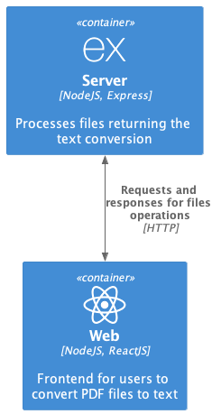

# Latii test tech
Latii code challenge. The current monorepo contains a server and web projects to convert PDF files to text.

<p align="center">
  
</p>

<sub>You can find the model C4 script of the image above [here](docs/project.infrastrure.puml).</sub>

## Overview:

This monorepository contains two projects: `/server` and `/web`. Both are detailed below:

### `/server`

The server of the challenge is a NodeJS application built with TypeScript using Express as framework. The server handles files (PDF by the moment) and using a third party dependency (`pdf-to-text`), returns the text content of it.

Express was the chosen framework for the server beacuse the simplicity of the development using it (the project is not big enough to use some more structured frameworks) and the availability of third party libraries. Altough Fastify could have been chosen as well, my experience is way more related to Express.

The way the server was built enables an easy way to extend the convert-to-text funcionality to other kind of documents by using a common interface: `FileService`. This also allows to extend the set of methods over documents.

In adition, any kind of `FileService` or any other service can be easily injected to the routes using an `Injector` helper function. This `Injector` is a expression of the Dependecy Injection pattern due the lack of Inversion of Control tools enabled by Express (and not other frameworks like NestJS). This way to inject classes allows also a better way to test the code by decoupling a class with their dependencies.

Files are stored using `multer` in the local disk and deleted after the file is processed.

Testing was done using `jest` at unit and integration level. Besides, a coverage threshold was set, so it forces developers to fully test the code (or at least, the 75% of the lines available). This output can be passed down to a CI strategy to disable the merging and deployment if the requirements are not met.

Development experience was improved by exposing a `dev` script mode where live code reloading is enabled using `nodemon` and `ts-node`.


### `/web`

The front part of the challenge is an NodeJS SPA built with TypeScript using ReactJS. The CSS was done using `bootstrap`. The front exposes a form that enables the uploading of a file and sends it to the server (using `axios`) to the processing of it, showing the result in the same page.

ReactJS is well known for single page applications and is where I'm more used to work in frontend as the way of development is related to POO and reactive programming, so that's why it was chosen. Altough a vanilla JS and HTML project could work, testing and a good development experience (using TypeScript) is way easier to achieve using React and the project setup is pretty straightforward using Create React App.

The frontend is based on components that encapsulates certain sections of the application. In the case of the challenge, was created a `FileUpload` component that draws a form and has the logic to: set a file to upload it, show a loading bar to see the progress of the processing and show the result of the conversion.

The HTTP client that enables the upload of the file is separated from the UI and reactive logic of the components in a `file.http.client` service. The concerns are split so changes in the way the request is done, shouldn't modify UI or its logic.

Testing was done using `jest` at integration level. No snaptshots were used to validate HTML changes even they could be used. The use case of the project allows to mock the HTTP request using `axios-mock-adapter`, however, the usage of a worker that intercepts network calls like `msw` might be needed if the project scales. The use of a coverage threshold was set at 75% of the lines as well.


### Improvements

Due the time given for the challenge, some feature were missing but can be implemented to improve the development experience, CI and CD strategies and errors response:
- [ ] Linter and formatters for code presentation (using `ESLint` and/or `prettier`) in both projects
- [ ] Usage of documentation built by code like `swagger` for the backend endpoints.
- [ ] Improve the responsiveness of the UI.
- [ ] Set a pipeline validation using GitHub Actions (or any other CI/CD tool) to 1) format and lint the code, 2) execute tests, 3) validate the coverage, 4) generate the documentation.
- [ ] Create a more robust exception strategy using standarized responses and use cases in both, UI and backend.


## Running the app

For a local execution is required the use of NodeJS v18.12.1 and npm 8.19.2. An OS library is needed to the parsing of files `pdftotext`:

1. Install `pdftotext` at OS level (for MacOS):
```bash
brew install xpdf
```
<sub> For other operative systems check [here](https://github.com/zetahernandez/pdf-to-text#installation)</sub>

2. Starting in this folder, enter in both: `/server` and `/web` folders in separate bash shells.

```bash
cd [server|web]
```

3. Install both projects dependecies using npm (in each shell):
```bash
npm i
```

4. Build and start the server:
```bash
npm run launch
```

5. Start the frontend:
```bash
npm run start
```

And that't it! You can see the available endpoints to test the server in the next section or use it by using the web page located in http://localhost:3000.

## Available endpoints

You can find the list of endpoints available in this [section](/docs/api.md).

## Testing

Both projects have tests to be executed. You can run these tests with `npm run test` inside each project folder and having installed the dependecies of the project with `npm i`.

## Author

Built by Sebastian Mancipe.
